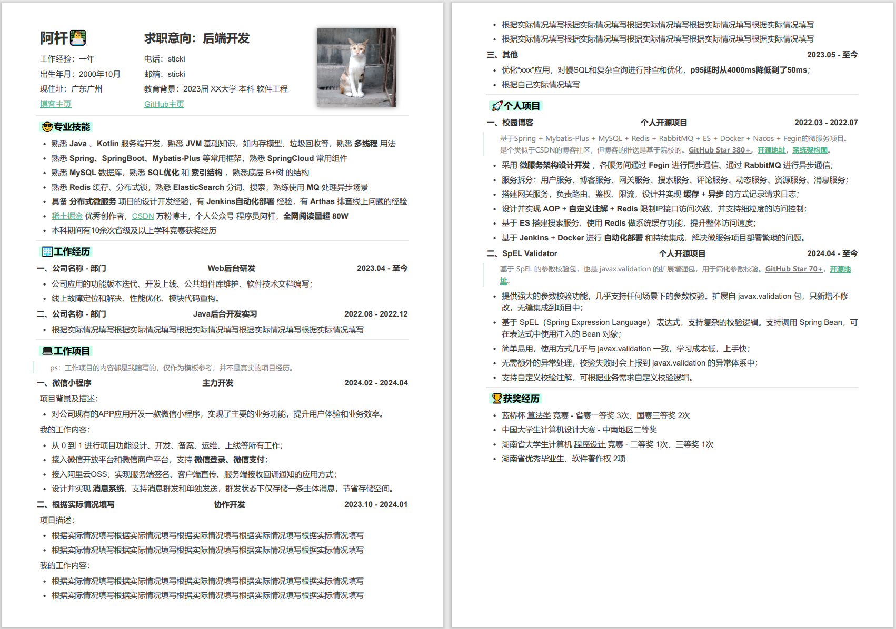

<h1 align="center">阿杆的Markdown简历模板</h1>

适合程序员的简历模板，基于Markdown编写，同时搭配了一点点HTML和CSS，让简历既容易修改又较为美观。

# 使用方式

> 推荐搭配 Typora 使用，可以切换不同主题，挑选自己喜欢的风格。
> 如果没有 Typora，也可以使用其他Markdown编辑器。

1. 克隆本项目到本地
2. 使用 Typora 打开 [阿杆_Java后端开发.md](./阿杆_Java后端开发.md) 文件
3. 修改内容，保存
4. 使用 Typora 导出 HTML 文件
5. 使用浏览器打开 HTML 文件，查看效果，并进行微调
6. 在浏览器中将 HTML 文件保存为 PDF 文件，用于投递简历

完整的教程，可以参考 [关于如何使用 Markdown 写出一份漂亮的简历](https://blog.sticki.cn/#/other/Markdown%E5%88%B6%E4%BD%9C%E7%AE%80%E5%8E%86%E6%95%99%E7%A8%8B) （[备用链接](https://juejin.cn/post/7152386844984868878)）

额外说明：模板中的 ==标题== （双等号） 是 Typora 的扩展语法，表示高亮显示。需要在 Typora 设置中开启该功能，才能看到效果。

# 项目结构

- `README.md`：项目说明文档
- `阿杆_Java后端开发.md`：简历模板
- `阿杆_Java后端开发.pdf`：使用模板导出的PDF文件
- `typora-theme`：存放作者使用的 Typora 主题文件（如果你想要跟我一样的样式，可以使用这个主题）
- `image`：存放文档中的图片

# 效果预览

# 关于作者

- 公众号：程序员阿杆
- 掘金：[阿杆的主页](https://juejin.cn/user/4182956056773160/posts)
- 微信：sticki6（添加时请备注来意）

微信交流群：加我微信拉你进群 `sticki6`，备注 **简历**
