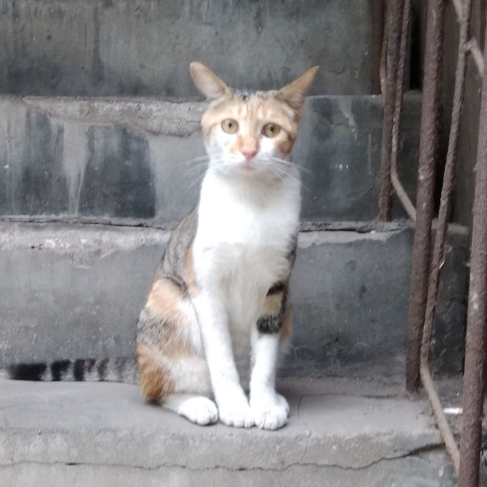

<table>
	<tr style="height: 50px;">
		<td style="font-size: 1.8em;"><strong>阿杆👨‍💻</strong></td>
		<td style="font-size: 1.5em;"><strong>求职意向：后端开发</strong></td>
		<td rowspan="5">
			
		</td>
	</tr>
	<tr>
		<td>工作经验：一年</td>
		<td>电话：sticki</td>
	</tr>
	<tr>
		<td>出生年月：2000年10月</td>
		<td>邮箱：sticki</td>
	</tr>
	<tr>
		<td>现住址：广东广州</td>
		<td>教育背景：2023届 XX大学 本科 软件工程</td>
	</tr>
	<tr>
		<td><a href="https://juejin.cn/user/4182956056773160/posts">博客主页</a></td>
		<td><a href="https://github.com/stick-i">GitHub主页</a></td>
	</tr>
</table>

### ==😎专业技能==

- 熟悉 **Java** 、**Kotlin** 服务端开发，熟悉 **JVM** 基础知识，如内存模型、垃圾回收等，熟悉 **多线程** 用法
- 熟悉 **Spring、SpringBoot、Mybatis-Plus** 等常用框架，熟悉 **SpringCloud** 常用组件
- 熟悉 **MySQL** 数据库，熟悉 **SQL优化** 和 **索引结构** ，熟悉底层 B+树 的结构
- 熟悉 **Redis** 缓存、分布式锁，熟悉 **ElasticSearch** 分词、搜索，熟练使用 **MQ** 处理异步场景
- 具备 **分布式微服务** 项目的设计开发经验，有 **Jenkins自动化部署** 经验，有 **Arthas** 排查线上问题的经验
- [稀土掘金](https://juejin.cn/user/4182956056773160/posts) 优秀创作者，[CSDN](https://blog.csdn.net/little_stick_i?type=blog) 万粉博主，个人公众号 程序员阿杆，**全网阅读量超 80W**
- 本科期间有10余次省级及以上学科竞赛获奖经历

### ==🏢工作经历==

<h4 style="display: flex;justify-content: space-between;">
一、公司名称 - 部门Web后台研发2023.04 - 至今
</h4>

- 公司应用的功能版本迭代、开发上线、公共组件库维护、软件技术文档编写；
- 线上故障定位和解决、性能优化、模块代码重构。

<h4 style="display: flex;justify-content: space-between;">
二、公司名称 - 部门Java后台开发实习2022.08 - 2022.12
</h4>

- 根据实际情况填写根据实际情况填写根据实际情况填写根据实际情况填写根据实际情况填写

### ==💻工作项目==

> ps：工作项目的内容都是我瞎写的，仅作为模板参考，并不是真实的项目经历。

<h4 style="display: flex;justify-content: space-between;">
一、微信小程序主力开发2024.02 - 2024.04
</h4>
项目背景及描述：

- 对公司现有的APP应用开发一款微信小程序，实现了主要的业务功能，提升用户体验和业务效率。

我的工作内容：

- 从 0 到 1 进行项目功能设计、开发、备案、运维、上线等所有工作；
- 接入微信开放平台和微信商户平台，支持 **微信登录、微信支付**；
- 接入阿里云OSS，实现服务端签名、客户端直传、服务端接收回调通知的应用方式；
- 设计并实现 **消息系统**，支持消息群发和单独发送，群发状态下仅存储一条主体消息，节省存储空间。

<h4 style="display: flex;justify-content: space-between;">
二、根据实际情况填写协作开发2023.10 - 2024.01
</h4>
项目描述：

- 根据实际情况填写根据实际情况填写根据实际情况填写根据实际情况填写根据实际情况填写
- 根据实际情况填写根据实际情况填写根据实际情况填写根据实际情况填写根据实际情况填写

我的工作内容：

- 根据实际情况填写根据实际情况填写根据实际情况填写根据实际情况填写根据实际情况填写
- 根据实际情况填写根据实际情况填写根据实际情况填写根据实际情况填写根据实际情况填写
- 根据实际情况填写根据实际情况填写根据实际情况填写根据实际情况填写根据实际情况填写
- 根据实际情况填写根据实际情况填写根据实际情况填写根据实际情况填写根据实际情况填写

<h4 style="display: flex;justify-content: space-between;">
三、其他2023.05 - 至今
</h4>

- 优化“xxx”应用，对慢SQL和复杂查询进行排查和优化，**p95延时从4000ms降低到了50ms**；
- 根据自己实际情况填写

### ==🚀个人项目==

<h4 style="display: flex;justify-content: space-between;">
一、校园博客个人开源项目2022.03 - 2022.07
</h4>

> 基于Spring + Mybatis-Plus + MySQL + Redis + RabbitMQ + ES + Docker + Nacos + Fegin的微服务项目。是个类似于CSDN的博客社区，但博客的推送是基于院校的。**<u>GitHub Star 380+</u>，[开源地址](https://github.com/stick-i/scblogs)，[系统架构图](https://gitee.com/sticki/scblogs/raw/main/document/image/scblogs-framework.png)**。

- 采用 **微服务架构设计开发** ，各服务间通过 **Fegin** 进行同步通信、通过 **RabbitMQ** 进行异步通信；
- 服务拆分：用户服务、博客服务、网关服务、搜索服务、评论服务、动态服务、资源服务、消息服务；
- 搭建网关服务，负责路由、鉴权、限流，设计并实现 **缓存** + **异步** 的方式记录请求日志；
- 设计并实现 **AOP** + **自定义注解** + **Redis** 限制IP接口访问次数，并支持细粒度的访问控制；
- 基于 **ES** 搭建搜索服务、使用 **Redis** 做系统缓存功能，提升整体访问速度；
- 基于 **Jenkins** + **Docker** 进行 **自动化部署** 和持续集成，解决微服务项目部署繁琐的问题。

<h4  style="display: flex;justify-content: space-between;">
二、SpEL Validator个人开源项目2024.04 - 至今
</h4>

> 基于 SpEL 的参数校验包，也是 javax.validation 的扩展增强包，用于简化参数校验。**<u>GitHub Star 70+</u>，[开源地址](https://github.com/stick-i/spel-validator)**。

- 提供强大的参数校验功能，几乎支持任何场景下的参数校验。扩展自 javax.validation 包，只新增不修改，无缝集成到项目中；
- 基于 SpEL（Spring Expression Language） 表达式，支持复杂的校验逻辑。支持调用 Spring Bean，可在表达式中使用注入的 Bean 对象；
- 简单易用，使用方式几乎与 javax.validation 一致，学习成本低，上手快；
- 无需额外的异常处理，校验失败时会上报到 javax.validation 的异常体系中；
- 支持自定义校验注解，可根据业务需求自定义校验逻辑。

### ==🏆获奖经历==

- 蓝桥杯 <u>算法类</u> 竞赛 - 省赛一等奖 3次、国赛三等奖 2次
- 中国大学生计算机设计大赛 - 中南地区二等奖
- 湖南省大学生计算机 <u>程序设计</u> 竞赛 - 二等奖 1次、三等奖 1次
- 湖南省优秀毕业生、软件著作权 2项

